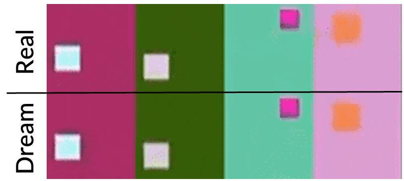
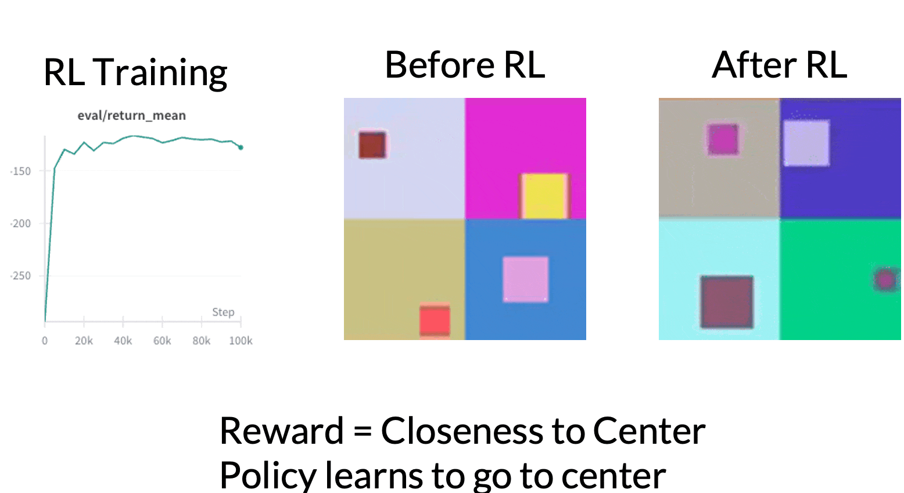
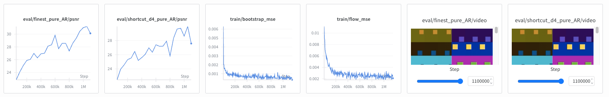
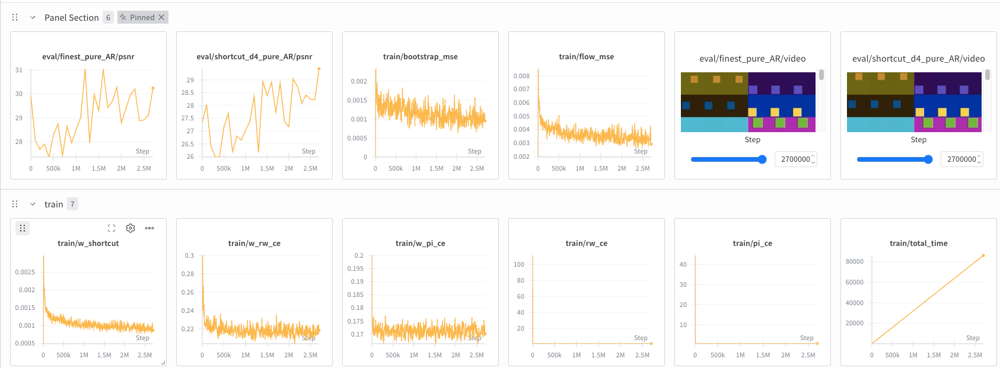
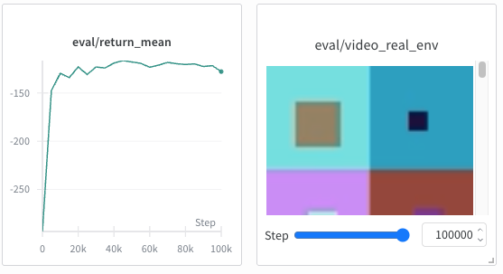

# Dreamer 4 World Models, in pure JAX

This repo is an unofficial implementation of the **[Dreamer 4](https://danijar.com/project/dreamer4/)** world model and RL agent from *“Training Agents Inside of Scalable World Models”* in pure JAX. This repo is designed to be educational and serve as a starting point for those interested in world models, RL, and Jax. 


At this stage, the entire world model + RL pipeline has been implemented and verified on a small bouncing square dataset. The authors are extending the codebase to solve harder tasks like CoinRun and eventually, Minecraft.  

> [!NOTE]
> We are looking for support - in terms of compute, advising, or feature development. Please get in touch if interested!


- [Website](https://danijar.com/project/dreamer4/)
- [Twitter](https://x.com/danijarh/status/1973072288351396320)

## Demo

At a high level, Dreamer 4 first trains an action-conditioned video diffusion model of the environment. Here, we show that the world model has learned to accurately predict the real dynamics of the bouncing square dataset.
<figure>
    
</figure>


Then, the agent is trained with RL in the world model. The reward is the proximity to the center of the image. We can see that the agent successfully learns to hover near the center.
<figure>
    
</figure>


## Repo Structure
- **Core library (`dreamer/`)**
  - `models.py` -- Space-time axial attention, causal tokenizer, interactive dynamics model, agent / reward / value heads.
  - `data.py` -- Bouncing square dataset and environment 
  - `imagination.py` -- JIT-fused imagination / diffusion-style rollout code used for fast RL in latent space.
  - `sampler.py` - non-JIT sampling helpers for debugging / visualization.
  - `utils.py` -- training state helpers, checkpointing wrappers (Orbax), logging helpers.
- **Training & evaluation scripts (`scripts/`)**
  - `train_tokenizer.py` -- Trains the causal tokenizer (masked autoencoder over video).
  - `train_dynamics.py` -- Trains the interactive dynamics model on top of the frozen tokenizer.
  - `train_bc_rew_heads.py` -- Adds behavior cloning and reward prediction heads on the world model (agent tokens + reward head).
  - `train_policy.py` -- Runs Dreamer‑style RL purely in imagination using the learned world model and heads (PMPO-style update).
  - `eval_bc_rew_heads.py` -- Evaluation script to verify BC / reward finetuning
- **Docs & logs**
  - `docs/` -- Figures, videos, and notes from development (e.g., reconstructions, imagination rollouts).

This repo is intentionally built to be easy to modify. If you want to understand or change the algorithm, start from the training scripts under `scripts/` and follow the calls into `dreamer/`.

## Setup

We use `uv` to manage the environment and dependencies (see `pyproject.toml` / `uv.lock`):

```bash
uv sync      # creates .venv and installs packages
source .venv/bin/activate # activate venv
uv pip install -e . # install this project as an editable package
```

By default, this installs the **CPU** version of JAX. For GPUs, follow the official JAX instructions, for example:

```bash
uv pip install "jax[cuda12]"
```

The code should run on any relatively recent GPU, but all logic should also run (more slowly) on CPU.

## Training Pipeline
Dreamer 4 follows a 4-stage training pipeline.
- **Phase 1**: Train a causal tokenizer (MAE-style) on videos.
- **Phase 2**: Train an interactive dynamics model in latent space of the tokenizer.
- **Phase 3**: Add agent tokens, BC / reward heads with behavior cloning and reward prediction.
- **Phase 4**: Train a policy on imagination trajectories from the dynamics model.

The default experiments use the synthetic **bouncing square** dataset, where an agent controls a square in a small grid using WASD commands and is rewarded for staying in the center.

To run the training pipeline, edit the configs in each script's `__main__` block and execute:

```bash
# Phase 1: Train the causal tokenizer
python scripts/train_tokenizer.py

# Phase 2: Train the dynamics model (requires tokenizer checkpoint)
python scripts/train_dynamics.py
# Edit tokenizer_ckpt in the config to point to your Phase 1 checkpoint

# Phase 3: Train BC/reward heads (requires tokenizer + dynamics checkpoints)
python scripts/train_bc_rew_heads.py
# Edit tokenizer_ckpt and pretrained_dyn_ckpt in the config

# Phase 4: Train policy in imagination (requires BC/reward checkpoint)
python scripts/train_policy.py
# Edit bc_rew_ckpt in the config to point to your Phase 3 checkpoint
```

All scripts save checkpoints under `logs/{run_name}/checkpoints/` by default. You can also enable wandb logging by setting `use_wandb=True` in the configs.

## Experimental Results
A log of the training process.

#### MAE training
The MAE, after training, should have around 40 PSNR, and the visualizations should show perfect reconstruction from masked inputs.


<figure>
    
  <figcaption>Ground Truth, Masked Input, Reconstructions</figcaption>
</figure>

#### Dynamics training
The dynamics model is trained. It should get around ~30 PSNR in the autoregressive generations using diffusion, and ~29 PSNR using shortcut. The generations should look almost pixel perfect.

<figure>
    
  <figcaption>Dynamics model training curves. </figcaption>
</figure>

#### Reward / BC training
Agent tokens, Reward / BC heads are trained on top of the dynamics model, and the dynamics model is finetuned to prevent collapse.
<figure>
    
  <figcaption>Reward / BC / Dynamics model losses. </figcaption>
</figure>

#### RL in imagination
The policy is trained with RL on imagination rollouts from the dynamics model.
<figure>
    
  <figcaption>RL training curves. The returns increase and the policy stays in the center. </figcaption>
</figure>


## References and Acknowledgements
This implementation references:
- **Dreamer 4**: [“Training Agents Inside of Scalable World Models”](https://danijar.com/project/dreamer4/)
- **Jasmine** ["Jasmine: A simple, performant and scalable JAX-based world modeling codebase"](https://github.com/p-doom/jasmine)

The authors would like to thank Danijar and the Jasmine team (Mihir, Franz, Alfred) for their advice. 